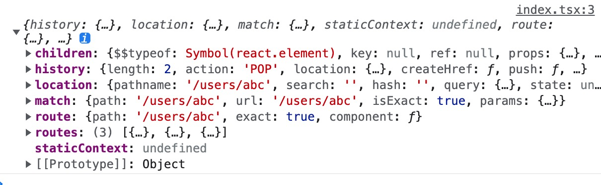

从 v1 到 v2
===

### 升级准备
- 1.请先升级到 1.x 的最新版本。


### 技术调整
- 1.[antd 从 v4 到 v5](https://ant.design/docs/react/migration-v5-cn)
- 2.[umi  从 v3 到 v4](https://ant.design/docs/react/migration-v5-cn)
- 3.`basic-layouts` 重构，并添加 `useLayouts` 的hooks [`2b3ad38`](https://github.com/antdpro/antdp/commit/2b3ad38deca0b31b9f575980bf1239249ae738b5)
- 4.`Authorized` 添加 `AuthorizedConfigProvider和useAuthorizedonfig` [`cf75f09`](https://github.com/antdpro/antdp/commit/cf75f096ad0646a1e831f45141cc7c84c1442c2d)
- 5.`react` 升级至 `18.x`

### 修复功能
- 🐞 fix:修复文档和权限取值判断 [`978d203`](https://github.com/antdpro/antdp/commit/978d2038c395d0252bb4409973703d776c10213c)
- 🐞 fix:修复预览标签 [`5968554`](https://github.com/antdpro/antdp/commit/5968554197f09bd5d8b1f75331f2102bf38e4ec2)
- 🐞 fix:修复 umi setup [`a128746`](https://github.com/antdpro/antdp/commit/a128746362ad5804d0e94c9e9be0daff1a1b5cf3)
- 🐞 fix:修复案例包版本 [`f45300b`](https://github.com/antdpro/antdp/commit/f45300b90841b2435745c9a3460fd74c2131383b)
- 🆎 type:修复类型 [`29eeb92`](https://github.com/antdpro/antdp/commit/29eeb926c64a1958d7e8723462b75d28bddb1c90)
- 🐞 fix:修复表单设置初始隐藏表单项 [`86ac78f`](https://github.com/antdpro/antdp/commit/86ac78f4af5c7409c981501f633b60989d5c97b0)
- 🐞 fix:修复本地文档预览网站 [`869d72b`](https://github.com/antdpro/antdp/commit/869d72bc69132fd5b4f2faa4044ffd923e8f16ce)
- 🆎 type:修复类型 [`2b68319`](https://github.com/antdpro/antdp/commit/2b683192c1f3af1fed393c6329e8789ad09b986a)
- 🐞 fix:修复菜单隐藏问题 [`9bc0070`](https://github.com/antdpro/antdp/commit/9bc00702e76eb8548dc7f0f9022afffa804f85cf)
- 💄 chore:修复website依赖问题 [`7ce8e30`](https://github.com/antdpro/antdp/commit/7ce8e301a0880b36d9ef923f3c4e4477663dafe7)
- 💄 chore:修复依赖 [`a17a49a`](https://github.com/antdpro/antdp/commit/a17a49acae6e63cf38a0c8fb8941b8cb902652b9)
- 🐞 fix:修复渲染判断 [`c5e96df`](https://github.com/antdpro/antdp/commit/c5e96df0d50922ce08beef55844a0efe76735bbc)
- 🐞 fix:修复命令运行 [`8083747`](https://github.com/antdpro/antdp/commit/80837475fd9b8aa177d53a99ef8b41cc12b93273)
- 🐞 fix:修复全屏按钮 [`4f0c851`](https://github.com/antdpro/antdp/commit/4f0c8515a5467e776bc243b33f8ac67fec6c5523)

### 开始升级

#### 依赖层升级
```diff
  "dependencies": {
     ...
-    "@antdp/antdp-ui": "1.8.27",
-    "@antdp/authorized": "1.8.27",
-    "@antdp/basic-layouts": "1.8.27",
-    "@antdp/edit-table": "1.8.27",
-    "@antdp/hooks": "1.8.27",
-    "@antdp/page-loading": "1.8.27",
-    "@antdp/request": "1.8.27",
-    "@antdp/user-login": "1.8.27",
-    "ahooks": "~3.3.0",
-    "antd": "4.24.1",
-    "react": "17.0.2",
-    "react-dom": "17.0.2"
+    "@antdp/antdp-ui": "2.0.0",
+    "@antdp/authorized": "1.8.27",
+    "@antdp/basic-layouts": "1.8.27",
+    "@antdp/edit-table": "1.8.27",
+    "@antdp/hooks": "1.8.27",
+    "@antdp/page-loading": "1.8.27",
+    "@antdp/request": "1.8.27",
+    "@antdp/user-login": "1.8.27",
+    "ahooks": "~3.7.2",
+    "antd": "5.1.7",
+    "react": "18.2.0",
+    "react-dom": "18.2.0"
     ...
  }
```

```diff
  "devDependencies": {
-    "@antdp/config": "1.8.27",
-    "@antdp/dependencies": "1.8.27",
-    "@umijs/plugin-dva": "0.13.2",
-    "@umijs/plugin-locale": "0.16.0",
-    "@umijs/plugin-model": "2.6.2",
-    "@umijs/plugin-request": "2.9.0",
-    "@umijs/test": "3.5.20",
-    "lint-staged": "~12.3.7",
-    "prettier": "2.4.1",
-    "react-sortable-hoc": "2.0.0",
-    "umi": "~3.5.35"
+    "@antdp/config": "2.0.0-bate-4.1",
+    "@antdp/dependencies": "2.0.0-bate-4.1",
+    "@umijs/max": "~4.0.47",
+    "@umijs/plugin-model": "~2.6.2",
+    "lint-staged": "~13.0.4",
+    "prettier": "2.8.1"
  }
```

#### 代码层修改

Umi 4 中将 react-router@5 升级到 react-router@6，所以路由相关的一些 api 存在着使用上的差异。

props 默认为空对象，以下属性都不能直接从 props 中取出
<!--rehype:style=max-width: 650px;width: 100%;-->

#### AuthorizedConfigProvider
使用 `AuthorizedConfigProvider`可以自己进行重新设置组件包裹内的所有按钮的权限参数，不使用默认配置的按钮权限配置
```diff
  sessionStorage.setItem("authBtn",JSON.stringify([{menuUrl:"/api/select"}]))

  import React from "react"
+ import { AuthorizedBtn ,AuthorizedConfigProvider } from "@antdp/authorized"

  const Page = ()=>{
    return (
+      <AuthorizedConfigProvider isCheckAuth={true} >
        <AuthorizedBtn path="/api/select" >
          <button>查询</button>
        </AuthorizedBtn>
+      </AuthorizedConfigProvider>
  )
}
export default Page;
```


#### history
```diff
+ import { history } from '@umijs/max';
export default function Page(props) {
  return (
    <div onClick={()=>{
-     props.history.push('list');
+     history.push('list');
    }}>
    </div>
  );
} 
```
#### location
```diff
+ import { useLocation } from '@umijs/max';
export default function Page(props) {
+    let location = useLocation();
  return (
    <div>
-     { props.location }
+     { location }
    </div>
  );
}
```

#### match
```diff
+ import { useMatch } from '@umijs/max';
export default function Page(props) {
+ const match = useMatch({ path: 'list/search/:type' });
  return (
    <div>
-     { props.match }
+     { match }
    </div>
  );
}
```
在 class component 组件中的使用方式:
```diff
+import { matchPath } from '@umijs/max';
class Page extends Component {
+  match = matchPath({ path: 'list/search/:type' }, window.location.pathname);
  state = {}
  render() {
    return (
      <div>
-        {this.props.match.type}
+        {this.match.type} 
      </div>
    )
  }
}
```
#### SelectLang 和 useIntl
```diff
+ import { SelectLang,useIntl } from '@umijs/max';
import BasicLayout from '@antdp/basic-layouts';
export default function Page(props) {
+ const match = useMatch({ path: 'list/search/:type' });
  return (
    <BasicLayout
+      topRightLanguage={<SelectLang />}
+      intlLanguage={useIntl()}
    />
  );
}
```

#### useModel

```diff
+ import { useModel } from '@umijs/max';
export default function Page(props) {
+ const { token } = useModel('user', (model) => ({ ...model }));
  return (
    <div>{token}</div>
  );
}
```

更多 `Umi` 相关 [`api`](https://umijs.org/docs/api/api)
需要注意 match 数据的差异：
```bash
// match v5
isExact: true
params: {}
path: "/users/abc"
url: "/users/abc"

// match v6
params:{  }
pathname: "/list/search/articles"
pathnameBase: "/list/search/articles"
pattern: {path: 'list/search/:type'}
```
更多改动和 api 变更，请查阅[`react-router@6`](https://reactrouter.com/en/6.10.0)

#### location 中的 query 找不到？
```diff
- const { query } = history.location;
+ import { parse } from 'query-string';
+ const query = parse(history.location.search);
```